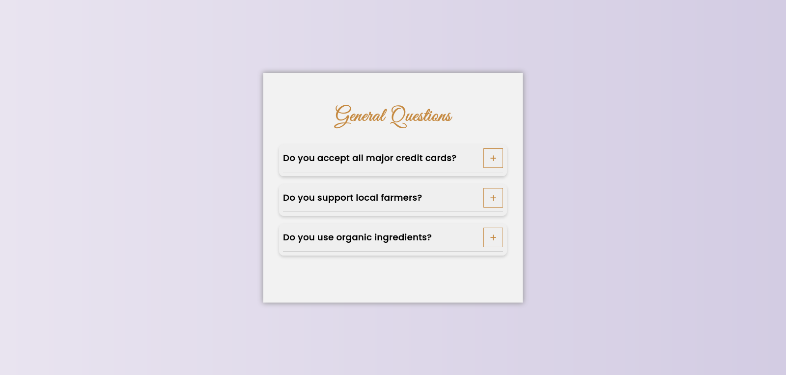
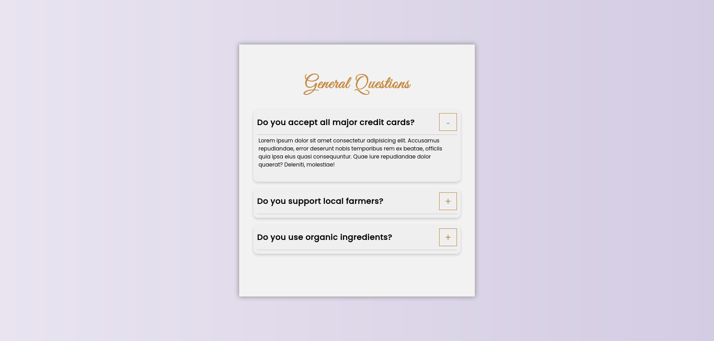

# FAQ Component

A simple FAQ component with expansive functionality.

## Screenshots

## Installation

1. Clone the repository `git clone https://github.com/AlexdelCarmen/question-component`
2. Open the `index.html` file in your browser.

## Features

- Buttons to hide and expland the FAQ answers. 

## Technologies

- HTML
- CSS
- JavaScript

## License

This program is licensed under the Unlicense, see the [License](./LICENSE) file for details.

## Credits

- Inspired in the [video](https://youtu.be/3PHXvlpOkf4) by John Smilga.

- Coded by [Alejandro Borges](https://github.com/AlexdelCarmen)

